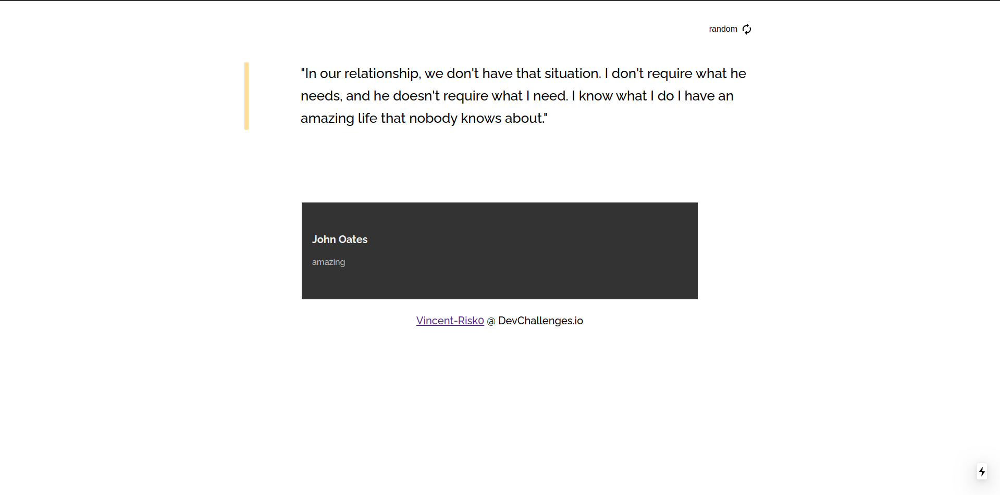

<h1 align="center">Project Name</h1>

<!-- Table of content-->

 ## Table of content

* [Overview](#overview)
    * [Built With](#built-with)
    * [Built by](#built-by)
* [Features](#features)

## Overview

I'm new with next.js so I starting a litle challenge to starting with. This challenges is pretty fun with an API. The site is deploy with Vercel on this [link](https://quote-generator-master.vincent-risk0.vercel.app/).
It's really fun to starting with a new technologie, I learn a lot, how to SSG, SSR and more.

### Built with

    

    

### Built by

**Vincent-Risk0**

    

## Features

Thanks to [DevChallenges](https://devchallenges.io/) for the challenge :)

